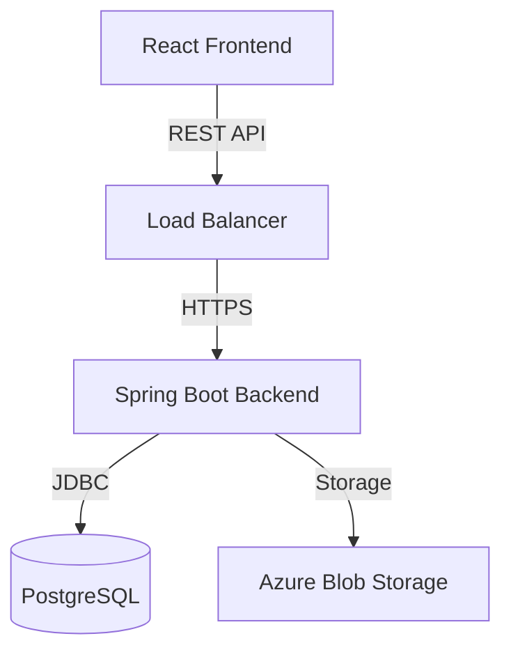

# InnoLink Developer Documentation

## 1. System Overview
InnoLink is a platform connecting Accredited Investors with Startups (Innovators). It facilitates deal flow, mandate matching, and secure document sharing.

## 2. Architecture

### Backend Architecture
Built with **Spring Boot 3** and **PostgreSQL**.
- **Layered Architecture:** Controller -> Service -> Repository -> Database.
- **Security:** Spring Security with JWT Authentication.
- **Database:** PostgreSQL with `pgvector` (planned) for AI features.
- **API:** RESTful endpoints.



### Frontend Architecture
Built with **React (Vite)** and **Tailwind CSS**.
- **State Management:** Context API (`AuthContext`).
- **Routing:** `react-router-dom`.
- **Styling:** Tailwind CSS for utility-first styling.
- **HTTP Client:** Axios with interceptors for JWT injection.

## 3. Key Features

### Authentication
Secure login and registration for Innovators and Investors.


### Dashboard
Personalized dashboards for different user roles (Innovator vs Investor).


### Deal Room
A marketplace for investors to browse and filter startup deals.
*(Screenshot not available - requires backend data)*

### Mandate Management
Investors can create mandates to specify their investment criteria.
*(Screenshot not available - requires backend data)*

## 4. Setup Guide

### Prerequisites
- Java 17+
- Node.js 18+
- Docker (for PostgreSQL)
- Maven

### Environment Variables
Create a `.env` file or set these variables:
```bash
DB_HOST=localhost
DB_PORT=5432
DB_NAME=innovest
DB_USERNAME=postgres
DB_PASSWORD=postgres
JWT_SECRET=your_secure_secret_key_here
```

### Running Locally
1.  **Start Database:**
    ```bash
    docker-compose up -d
    ```
2.  **Start Backend:**
    ```bash
    mvn spring-boot:run
    ```
3.  **Start Frontend:**
    ```bash
    cd frontend
    npm install
    npm run dev
    ```
