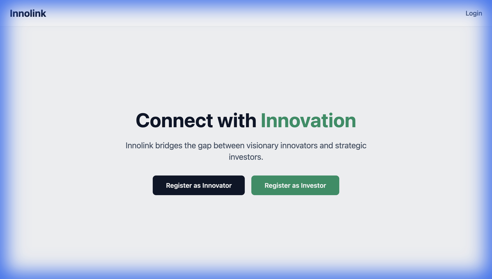
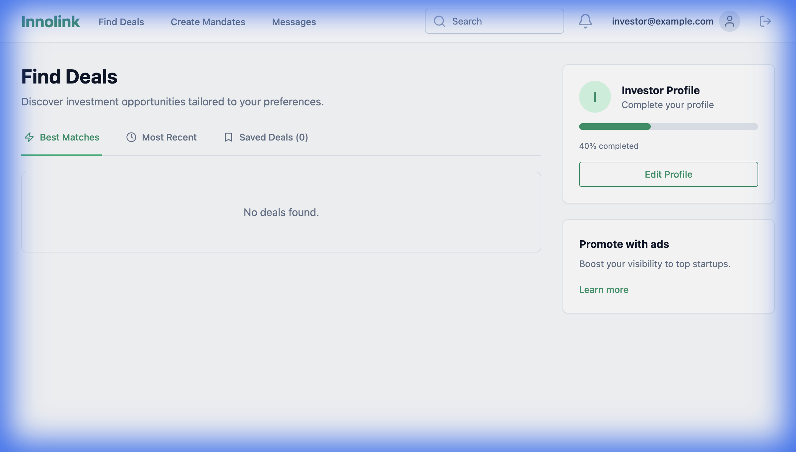

# InnoLink Platform

**InnoLink** is a premier matchmaking platform connecting Accredited Investors with high-potential Startups (Innovators). We facilitate seamless deal flow, intelligent matching, and secure document sharing.

## Key Features

### For Investors
- **Deal Flow**: Access a curated list of startup deals filtered by your preferences.
- **Mandates**: Create specific investment mandates to get matched with relevant startups.
- **Dashboard**: Track your interests, mandates, and deal progress in one place.

### For Innovators
- **Profile Management**: Showcase your startup with a comprehensive profile.
- **Deal Creation**: Publish your funding rounds and attract investors.
- **Secure Documents**: Share sensitive documents (pitch decks, financials) securely.

## Getting Started

### Prerequisites
- Docker
- Java 17
- Node.js 18+

### Quick Start
For detailed developer instructions, architecture diagrams, and setup guide, please refer to [DEVELOPER.md](DEVELOPER.md).

1.  **Clone the repository**
2.  **Start the Database**: `docker-compose up -d`
3.  **Run Backend**: `mvn spring-boot:run`
4.  **Run Frontend**: `cd frontend && npm run dev`

## Technology Stack
- **Backend**: Spring Boot 3, PostgreSQL, Spring Security (JWT)
- **Frontend**: React, Vite, Tailwind CSS
- **Infrastructure**: Docker, Azure (planned)

## License
Proprietary software. All rights reserved.
